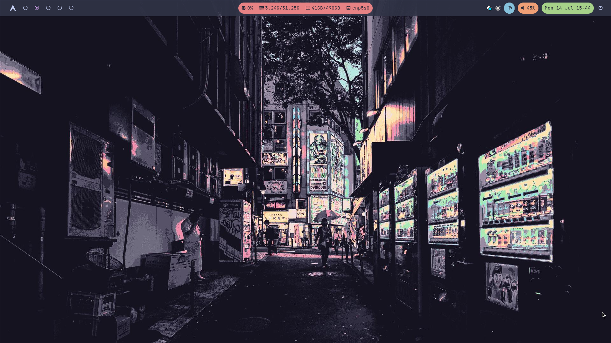
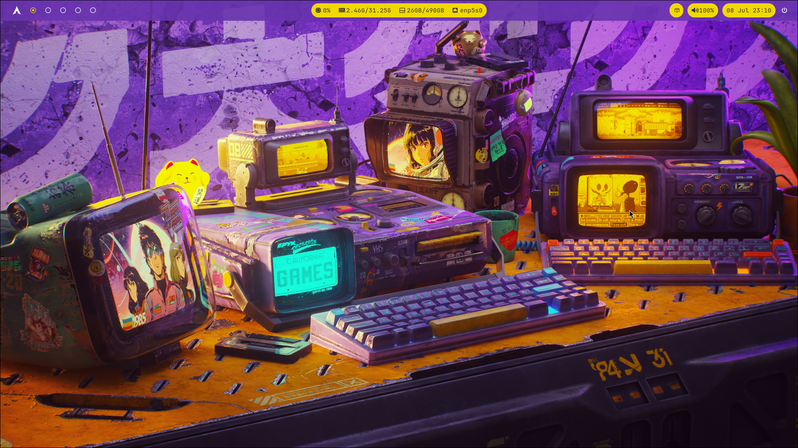

# Sōshoku 装飾
Dotfiles for my custom Hyprland theme based on [Synthwave 84](https://github.com/robb0wen/synthwave-vscode) colors. This script is heavily inspired and based on [Omarchy](https://github.com/basecamp/omarchy/).

## Themes

<details>
  <summary>Catppuccin</summary>
  
</details>

<details>
  <summary>Synthwave</summary>
  
</details>

## Software specs

**Linux Distro:** Arch Linux

**WM:** Hyprland

**Terminal:** Alacritty

**Launcher:** Wofi

**Statusbar:** Waybar

**Wallpaper:** [wallhaven.cc](https://wallhaven.cc/w/1q83qg)

**Fonts:** JetBrainsMono Nerd Font

## Installation

```bash
eval "$(wget -qO- https://raw.githubusercontent.com/ricardobarantini/soshoku/refs/heads/main/boot.sh)"
```
