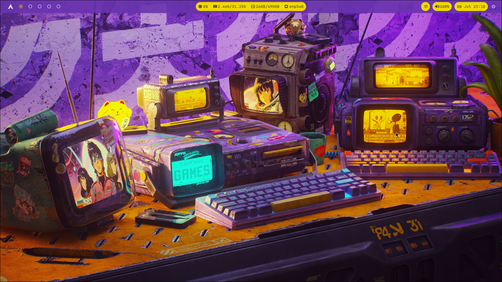

# Sōshoku 装飾
Dotfiles for my custom Hyprland theme. Color palette based on the current wallpaper.



## Software specs

**Linux Distro:** Arch Linux

**WM:** Hyprland

**Terminal:** Alacritty

**Launcher:** Wofi

**Statusbar:** Waybar

**Wallpaper:** [wallhaven.cc](https://wallhaven.cc/w/1q83qg)

**Fonts:** JetBrainsMono Nerd Font

## Installation

```bash
eval "$(wget -qO- https://raw.githubusercontent.com/ricardobarantini/soshoku/refs/heads/main/boot.sh)"
```